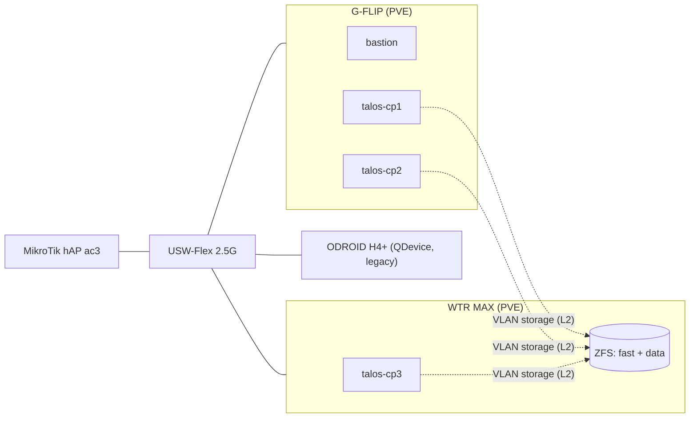

# Homelab

[](https://github.com/speedzenon/homelab-public/actions/workflows/ci.yml)
[](https://github.com/speedzenon/homelab-public/actions/workflows/security.yml)

Infrastructure-as-code dla mojego homelabu, prowadzonego jak środowisko produkcyjne:
pełny GitOps (każda zmiana przez podpisany commit i pull request), kompletna adresacja
i sekrety zaszyfrowane SOPS — **repo jest publiczne i nie zawiera ani jednego prywatnego
adresu IP w plaintext** — oraz automatyczne aktualizacje zależności przez Renovate.

## Architektura

### Sprzęt

| Host | Specyfikacja | Rola |
|---|---|---|
| AOOSTAR G-FLIP | Ryzen AI 9 HX 370 · 128 GB RAM · 2× 1 TB NVMe (ZFS stripe) | Compute: bastion + 2× Talos control-plane; docelowo workloady AI (iGPU + NPU) |
| AOOSTAR WTR MAX | Ryzen 7 PRO 8845HS · 80 GB ECC · NVMe boot + `fast` (2× 2 TB NVMe mirror) + `data` (2× 8 TB HDD mirror) | Node storage (ZFS, iSCSI/NFS) + 1× Talos control-plane |
| ODROID H4+ | Intel N97 · 16 GB RAM | QDevice (kworum klastra PVE) + usługi legacy; docelowo Proxmox Backup Server |
| MikroTik hAP ac3 | RouterOS | Router, bramy L3 dla VLAN-ów, WireGuard |
| Ubiquiti USW-Flex-2.5G-5 | 5× 2.5GbE | Switch — fabric hostów i sieci storage |

### Sieć

Dwanaście VLAN-ów segmentujących infrastrukturę (mgmt, infra, k8s, servers, storage,
dmz, observability, iot, sieci domowe i lab), zarządzanych deklaratywnie przez OpenTofu
(provider RouterOS). Pełna adresacja żyje wyłącznie w zaszyfrowanym
`infrastructure/network.sops.yaml` — pliki `.tf` operują referencjami, nigdy literałami.

Wyróżnik: **nieroutowany VLAN storage** — czysty segment L2 bez bramy na routerze.
Ruch iSCSI/NFS między węzłami Kubernetes a nodem storage nigdy nie przechodzi przez
router; interfejs storage węzła nie ma default route (jedna brama na węzeł, zero
asymetrii). Zdalny dostęp przez WireGuard; trwa greenfield przebudowa firewalla
w model zero-trust (etap obserwacji realnych przepływów przed finalnym drop).



### Stack (wdrożony)

- **Hypervisor:** Proxmox VE 9.2 — klaster 2 nodów + QDevice; firewall PVE zarządzany
  z OpenTofu; token API z dedykowaną rolą least-privilege
- **Provisioning:** OpenTofu (bpg/proxmox, terraform-routeros) + Just jako command runner
- **Kubernetes:** Talos Linux 1.12.6 / Kubernetes 1.35.2 — 3× control-plane z VIP,
  obrazy z Image Factory (qemu-guest-agent, iscsi-tools)
- **CNI:** Cilium 1.19.4 — kube-proxy replacement (eBPF), LB-IPAM + L2 announcements
  (usługi `LoadBalancer` bez port-forwardingu)
- **GitOps:** ArgoCD (app-of-apps, zarządza również samym sobą) + Renovate
- **Storage:** ZFS na nodzie storage; dedykowana sieć storage (drugi NIC węzłów,
  selekcja interfejsów po adresach MAC)
- **Secrets:** SOPS + age — pełne szyfrowanie adresacji i sekretów bootstrapu Talosa
- **Jakość:** pre-commit (yamllint, gitleaks, shellcheck, markdownlint, Conventional
  Commits, autorski hook blokujący plaintext RFC1918), CI (pre-commit, walidacja tytułu
  PR, gitleaks po pełnej historii, Trivy), podpisane commity + ruleset na `main`

## Stan projektu

### Zrealizowane

- Fundament repo: hooki, CI, podpisane commity, Renovate, workflow `just feat / pr / done`
- Sieć: VLAN-y i adresacja na MikroTiku w OpenTofu, całość zaszyfrowana SOPS
- Hypervisor: klaster PVE + QDevice, provisioning VM z OpenTofu, firewall jako kod
- Kubernetes: 3-węzłowy klaster Talos, Cilium z pulą LoadBalancer (L2), pełny health
- GitOps: ArgoCD app-of-apps, adopcja Cilium, self-management ArgoCD
- Storage: pule ZFS (`fast`, `data`) po burn-in dysków, nieroutowana sieć storage E2E

### W toku

- democratic-csi (`zfs-generic-iscsi`) — dynamiczne PVC ze snapshotami ZFS per wolumen
- Greenfield firewall MikroTik — zero-trust między VLAN-ami (obserwacja logów przepływów)

### Roadmapa

- Proxmox Backup Server na ODROID, replikacja ZFS między nodami, offsite (3-2-1)
- Observability (Prometheus, Grafana, Loki), później SIEM
- IAM (Authentik, OIDC), PKI (Step-CA), OpenBao + External Secrets Operator
- Polityki: Kyverno, Pod Security `restricted`, network policies (Cilium)
- Migracja usług legacy z ODROID na platformę; Ansible dla konfiguracji OS-level

## Struktura repozytorium

```text
homelab/
├── docs/                  Runbooki (docs/runbooks/local-setup.md), ADR, diagramy
├── bootstrap/             Manualne kroki Day-1
├── infrastructure/
│   ├── mikrotik/          VLAN-y, adresacja, DHCP (OpenTofu + RouterOS)
│   ├── proxmox/           VM, firewall PVE, obrazy (OpenTofu + bpg); moduł vm/
│   └── ansible/           Placeholder — konfiguracja OS-level (roadmapa)
├── talos/
│   ├── patches/           Patche machine config (szablony renderowane w just)
│   └── secrets/           Zaszyfrowane sekrety bootstrapu (SOPS)
├── kubernetes/            Źródło prawdy dla ArgoCD
│   ├── bootstrap/         Values instalacji Day-1 (Cilium, ArgoCD)
│   ├── apps/              Application-y (app-of-apps)
│   ├── infrastructure/    Zasoby klastrowe (pula LB Cilium, polityka L2)
│   └── platform/ policies/  Placeholdery pod roadmapę
├── justfile               Cały workflow: git, tofu, talos, bootstrap komponentów
└── .github/workflows/     CI + security pipeline
```

## Workflow

Każda zmiana przechodzi ten sam cykl — branch zawsze ze świeżego `main`, tytuł PR
z ostatniego commita, squash-merge z automatycznym usuwaniem brancha:

```bash
just feat nazwa-zmiany   # nowy branch ze swiezego main
# ...praca, podpisany commit (git commit -S)...
just pr                  # push + PR z poprawnym tytulem
just done                # po merge: sync, prune, sprzatniecie lokalnych branchy
```

## Praca lokalna

Wymagane narzędzia: `age`, `sops`, `gh`, `gpg`, `pre-commit`, `just`, `tofu`,
`talosctl`, `kubectl`, `helm`. Szczegóły w `docs/runbooks/local-setup.md`.
Runbook pełnego odtworzenia od zera — w przygotowaniu.

### Praca z plikami SOPS

Pliki z sekretami mają sufiks `.sops.yaml`; reguły szyfrowania definiuje `.sops.yaml`
w katalogu głównym. Edycja bez ręcznego odszyfrowywania (SOPS sam odszyfrowuje do
tymczasowego pliku, otwiera `$EDITOR` i szyfruje z powrotem przy zapisie):

```bash
sops infrastructure/network.sops.yaml
```

Odszyfrowanie na stdout (debug): `sops --decrypt plik.sops.yaml`.
Po zmianie listy odbiorców w `.sops.yaml`: `sops updatekeys plik.sops.yaml`.
Dla VS Code ustaw `EDITOR="code --wait"`, inaczej SOPS zaszyfruje plik przed edycją.

## Licencja

Projekt osobisty, bez przypisanej licencji — treść nie jest przeznaczona do redystrybucji.
